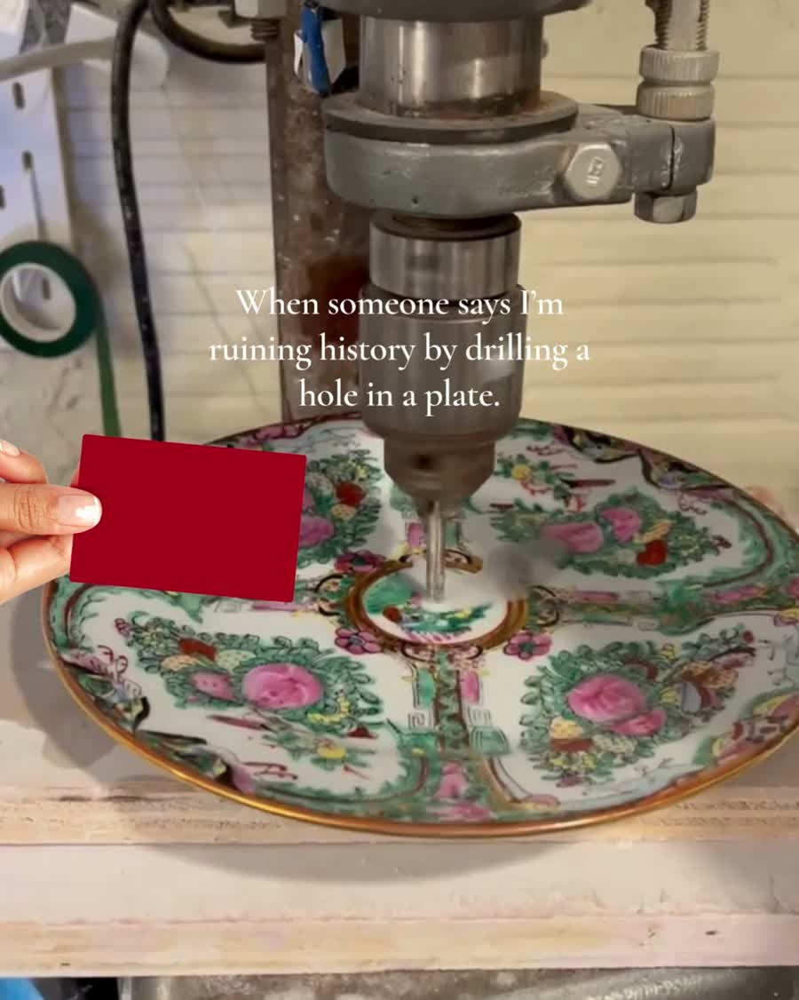
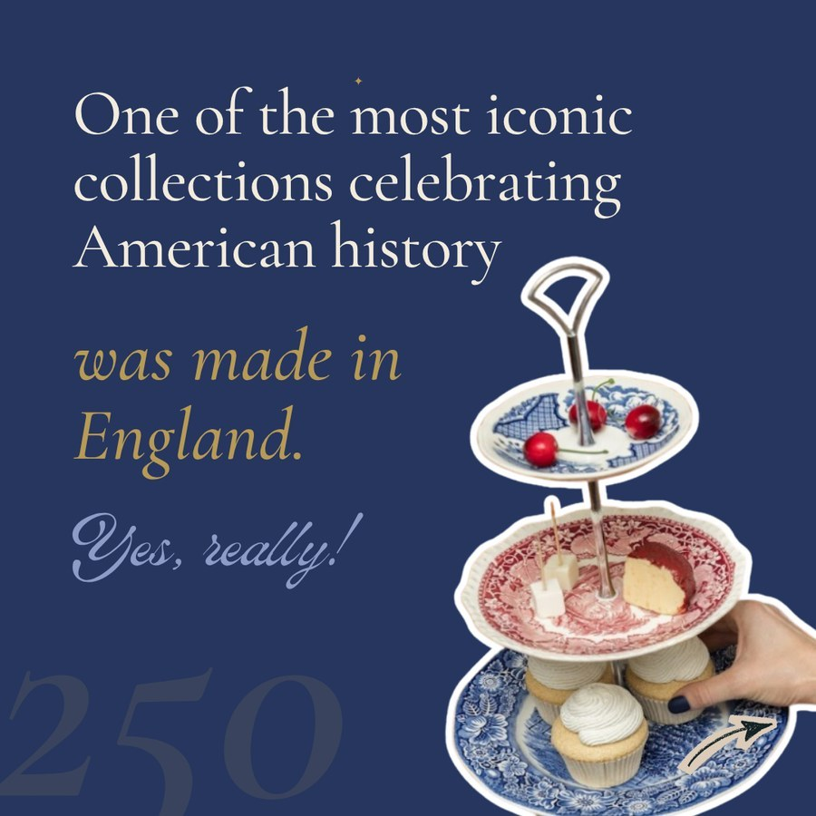

# The Brooklyn Teacup: July 2026

<!-- meta
client: BTC
period: 2026-07
audience: client
title: July 2026
published: 2026-08-04
summary: The writing in July was the best it's been. The problem was that most of it went out as carousels, which almost nobody outside the follower list ever sees.
-->

Lauren Knows Social · 4 August 2026 · Instagram and Facebook, June against July

---

## Some words I'll keep using

A **reel** is a video post. A **carousel** is a post you swipe through, made of photos or short clips or both. When I say **strangers** I mean people who saw a post but don't follow the account. Those are the ones who matter for growth, because a new follower has to come from someone who isn't already following.

---

## The short version

The writing in July was the best it's been. The red card post, the Blue Onion plate, "girl grip": those are the sharpest lines we've put on this account. July also had the biggest post of the summer in Back Stamp, which did 47,538 views on Facebook and picked up 76 followers on its own.

So why does the month look flat?

Mostly because of what the posts were, not what they said. We put out four reels in June and two in July. Everything else was carousels. On this account a reel gets shown to strangers about 70% of the time. A carousel gets shown to strangers about 2% of the time. Good writing inside a carousel reaches the people who already follow you and then stops.

There's a second thing, and I'd rather say it than dance around it. June had the studio closing in it. That was a real story with something at stake, and it did most of the heavy lifting for the month. We can't schedule one of those every four weeks, and I don't want to write a plan that pretends we can.

---

## June against July

### Instagram

| | June | July |
|---|---|---|
| Posts measured | 6 | 10 |
| Total views | 86,445 | 68,432 |
| Views per post | 14,408 | 6,843 |
| Strangers reached | 45,302 | 8,844 |
| New followers | 292 | 7 |
| Saves | 281 | 111 |
| Shares | 268 | 49 |
| Reels vs carousels | 4 reels / 2 carousels | 2 reels / 8 carousels |

### Facebook

| | June | July |
|---|---|---|
| Posts measured | 4 | 7 |
| Total views | 32,001 | 60,640 |
| New followers | 140 | 79 |
| Reels vs carousels | 4 reels / 0 carousels | 1 reel / 6 carousels |

Those tables will mislead you if I leave them there, because both months were really one post wearing a costume.

On Instagram in June, 250 of the 292 new followers came from a single post: "The pivot", the one about closing the studio. Another 36 came from the Granny carousel. Take those two out and the other four June posts brought in six followers between them. July's ten posts brought in seven.

So the fall from 292 to 7 is one exceptional post going away. It isn't ten posts failing, and I'd been reading it that way at first.

Facebook is the same trick in reverse. Back Stamp was 47,538 of July's 60,640 views. The other six Facebook posts averaged 2,184 views against June's 8,000.

Even the views-per-post line is doing this. June only averages 14,408 because of those two big ones. Compare the everyday stuff and June's four ordinary posts averaged 5,452 views while July's ten averaged 6,843. On normal content July was slightly ahead.

---

## The number I'd actually build on

Here's the share of each post's views that came from strangers, across all sixteen posts in both months.

| | Posts | Typical share from strangers |
|---|---|---|
| Reels | 6 | 70% (lowest 58%, highest 74%) |
| Carousels and single photos | 10 | 1.7% (lowest 0.9%, highest 43%) |

Six reels, ten carousels, and they barely overlap. Reels get put in front of people who don't follow you. Carousels mostly get shown to people who already do.

Another way to see it: a typical July carousel was seen by about 2,500 people. The account has 51,300 followers. So a carousel reached roughly one in twenty of the people already there, and almost nobody else.

But reaching strangers doesn't automatically turn them into followers, and this is the part I got wrong when I first looked at the numbers. June's ordinary reels did reach strangers, about 9,400 of them, and gained six followers. "The pivot" reached 20,800 and gained 250. Same account, same month, same format. The difference was that one of them had a person telling you something that mattered to her.

That's why "post more reels" is only half a plan.

---

## What worked

### Back Stamp, 22 July, reel

> "Ever wondered where your plates came from but had no idea where to begin? Start by flipping one over and checking the back stamp."

Facebook: 47,538 views, 68.6% strangers, 92 saves, 76 new followers.
Instagram: 6,032 views, 67.1% strangers, 40 saves.

Best post of the summer, and I think it's the most repeatable thing we made.

The cover is fifteen or so plates laid out in a tight grid, shot from above. It's busy and it's colourful and you can tell exactly what you're looking at even when it's thumbnail-sized in a feed. Nobody has to read a word to decide whether to stop.

Then the hook asks you to go and do something tonight, with a plate you already own. Which means the post isn't really about The Brooklyn Teacup, and that's precisely why so many people watched it. It also picked up more saves than anything else in July. People filed it away to use later.

One oddity. Our tracker marked it "Learning" rather than "Winner" on Instagram, because people watched only 26.7% of it and our bar is 30%. The bar is usually right. On a thirty-second explainer that reaches this many people and gets saved this often, it isn't.

### Red Card, 12 July, carousel

> "When someone says I'm ruining history by drilling a hole in a plate."

Instagram: 19,405 views, 11.0% strangers. Facebook: 4,700 views, 17.6% strangers.

Comfortably the strongest carousel of the month on both platforms, and you can see why. The first card is a video, so it moves while someone scrolls past it. The hook picks a fight people already have opinions about. And the joke lands in about a second without anyone having to read.

This is the same argument as June's best Facebook post, "Showing before and after", which did 18,108 views and 80 followers. That subject has now beaten everything around it twice, on both platforms. It's the most reliable idea this account has and we keep using it by accident.

### Pomegranates not onions, 27 July, carousel

> "It's called the Blue Onion pattern... but those aren't onions. What are they? Answer in caption."

Instagram: 11,667 views, 19 saves, 11 comments.
Facebook: 593 views, seen by 1,799 people.

Best engagement of any July carousel on Instagram. A real curiosity gap and a proper reason to go read the caption.

The Facebook numbers look worse than they are. The first card is a three-second video, and Facebook only counts a "view" once a video has played three seconds, or nearly all of it when it's shorter than that. So 1,799 people had it on screen and 593 of them stayed long enough to count. Call it a 33% hold rate.

Reach was fine. 1,799 is normal for a July Facebook carousel. What it didn't do was hold anyone still, and I suspect the fix is length. The same three seconds on Instagram registered 1.83 plays per person. Fifteen or twenty seconds of this story would be a different post.

---

## What didn't

**Hostess Gift Candle**, 15 July. 3,190 views, 1.6% strangers, 2 saves, no shares, no comments. Weakest post of the month on both platforms. It's a product listing. There's nothing in the hook that makes you want to know what happens next, and the background is arguing with the candle: there are bottles and letters and a speaker all fighting for the same space.

**Custom design sessions**, 25 July, a five-second reel. 1,999 views, 59.9% strangers, and people watched 80% of it, the highest figure of either month. This one looks like a failure and mostly isn't. It reached strangers the way every reel does. It's just too short to accumulate views. Along with the three-second card on Pomegranates, that's twice in July that a very short clip cost us reach. The camera-glasses angle is a good idea sitting on a clip with nowhere to go.

**Girl Grip**, 20 July. 3,344 views, 0.9% strangers, 2 saves, no comments. The funniest line of the month reached about thirty people who don't already follow the account. Two still photos, nothing moving.

**The designed graphic cards.** "Pick your stack" did 4,294 views at 1.2% strangers, and the patriotic china carousel 6,300 at 1.7%. Both nicely made, both reaching almost nobody new.

One carousel did break out, back in June. "The story behind Brooklyn Teacup" got 34,886 views with 43% of them from strangers, which is reel-level reach out of a carousel. Its first card is a photograph of Granny. That might be the reason, or it might be the story, or it might be the week it went out. It's one post, so I'd treat it as something to test rather than something we know.

---

## August

Put out one reel a week and give it the best idea of that week. This is the change that matters most, and it doesn't require writing differently. Red Card, Pomegranates and Girl Grip were the three sharpest things in July and all three went out in a format that couldn't carry them anywhere.

Then find one post a month with something genuinely at stake in it, told by a person. Reels get strangers looking. Only this gets them to stay. June's ordinary reels reached 9,400 strangers and gained six followers; "The pivot" reached 20,800 and gained 250. Not everything can be that. One a month can.

Give the drilling argument a proper slot. It's been the best idea of the month twice running now, on both platforms, and both times it turned up by chance rather than by plan.

Make more posts shaped like Back Stamp, especially for Facebook. Something the viewer can go and do tonight with a plate they already own, over a strong overhead shot. Facebook's audience owns more inherited china than Instagram's and Back Stamp showed what that's worth. Reading a maker's mark, telling bone china from porcelain, what crazing actually is, which patterns are worth real money.

And nothing under about ten seconds. Two posts made that case for us in July.

---

## A note on the numbers

Meta counts a "view" on a video only once it's played for three seconds, or nearly all of it on a shorter clip. "Viewers" is just how many people saw the post at all. On anything led by a video those two numbers are answering different questions, and the gap between them tells you about stopping power. It isn't an error. That's what's going on with the Facebook version of Pomegranates, and I'm adjusting how the tracker reads posts built that way.

It also means you can't line up a reel's view count against a photo carousel's, because video is being held to the stricter standard. That works in favour of what I've said here rather than against it.

Separately, the average we score posts against has come down over the last three weeks: Instagram from 7,241 to 5,163, Facebook from 4,329 to 3,336. That's a carousel-heavy month working its way through the average. It should climb back on its own once the mix changes. In the meantime posts are being judged against a lower bar than they were in June, so a run of good scores over the next few weeks won't necessarily mean much.

All figures are 7-day numbers, pulled from The Receipts tracker on 4 August 2026. Posts from 29 July onwards don't have a full seven days yet and aren't in any of the totals.
